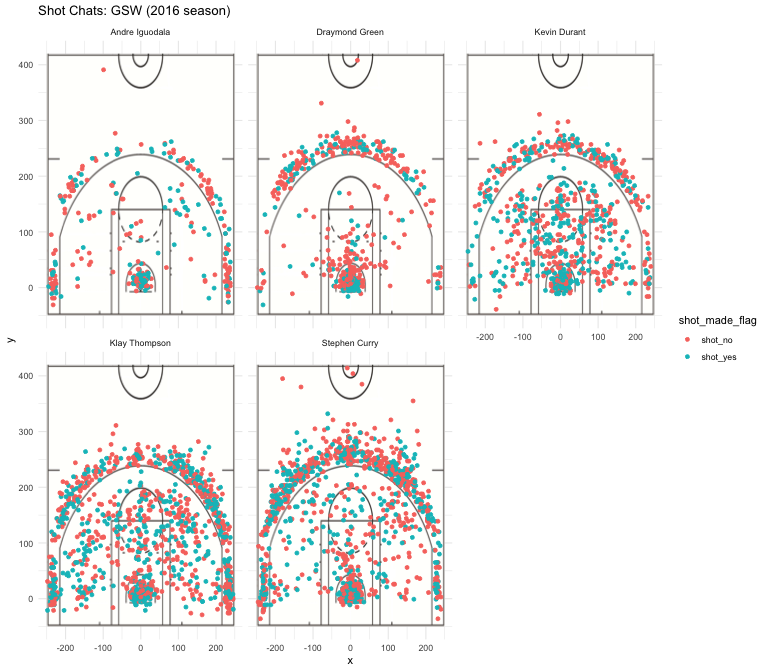

Workout 1
================
Sharon Cha

5.1) Effective Shooting Percentage
----------------------------------

``` r
library(dplyr)
```

    ## 
    ## Attaching package: 'dplyr'

    ## The following objects are masked from 'package:stats':
    ## 
    ##     filter, lag

    ## The following objects are masked from 'package:base':
    ## 
    ##     intersect, setdiff, setequal, union

``` r
dat <- read.csv("../data/shots-data.csv", stringsAsFactors = FALSE)
```

##### 2PT Effective Shooting % by Player

``` r
# Andre Iguodala 2PT Field Goal
andre_data <- filter(dat, name == 'Andre Iguodala')
andre_data <- select(andre_data, shot_type, shot_made_flag)

andre_total_2pt <- filter(andre_data, shot_type == '2PT Field Goal')
andre_total_2pt <- nrow(andre_total_2pt)


andre_made_2pt <- filter(andre_data, shot_made_flag == 'shot_yes')
andre_made_2pt <- filter(andre_made_2pt, shot_type == '2PT Field Goal')
andre_made_2pt <- nrow(andre_made_2pt)
 

andre_per <- andre_made_2pt / andre_total_2pt


# Draymond Green 2PT Field Goal
draymond_data <- filter(dat, name == 'Draymond Green')
draymond_data <- select(draymond_data, shot_type, shot_made_flag)

draymond_total_2pt <- filter(draymond_data, shot_type == '2PT Field Goal')
draymond_total_2pt <- nrow(draymond_total_2pt)


draymond_made_2pt <- filter(draymond_data, shot_made_flag == 'shot_yes')
draymond_made_2pt <- filter(draymond_made_2pt, shot_type == '2PT Field Goal')
draymond_made_2pt <- nrow(draymond_made_2pt)

draymond_per <- draymond_made_2pt / draymond_total_2pt


# Kevin Durant 2PT Field Goal
kevin_data <- filter(dat, name == 'Kevin Durant')
kevin_data <- select(kevin_data, shot_type, shot_made_flag)

kevin_total_2pt <- filter(kevin_data, shot_type == '2PT Field Goal')
kevin_total_2pt <- nrow(kevin_total_2pt)


kevin_made_2pt <- filter(kevin_data, shot_made_flag == 'shot_yes')
kevin_made_2pt <- filter(kevin_made_2pt, shot_type == '2PT Field Goal')
kevin_made_2pt <- nrow(kevin_made_2pt)


kevin_per <- kevin_made_2pt / kevin_total_2pt


# Klay Thompson 2PT Field Goal
klay_data <- filter(dat, name == 'Klay Thompson')
klay_data <- select(klay_data, shot_type, shot_made_flag)

klay_total_2pt <- filter(klay_data, shot_type == '2PT Field Goal')
klay_total_2pt <- nrow(klay_total_2pt)


klay_made_2pt <- filter(klay_data, shot_made_flag == 'shot_yes')
klay_made_2pt <- filter(klay_made_2pt, shot_type == '2PT Field Goal')
klay_made_2pt <- nrow(klay_made_2pt)


klay_per <- klay_made_2pt / klay_total_2pt


# Stephen Curry 2PT Field Goal
stephen_data <- filter(dat, name == 'Stephen Curry')
stephen_data <- select(stephen_data, shot_type, shot_made_flag)

stephen_total_2pt <- filter(stephen_data, shot_type == '2PT Field Goal')
stephen_total_2pt <- nrow(stephen_total_2pt)


stephen_made_2pt <- filter(stephen_data, shot_made_flag == 'shot_yes')
stephen_made_2pt <- filter(stephen_made_2pt, shot_type == '2PT Field Goal')
stephen_made_2pt <- nrow(stephen_made_2pt)


stephen_per <- stephen_made_2pt / stephen_total_2pt


twopt_chart <- data.frame("name" = c("Andre Iguodala", "Draymond Green", "Kevin Durant", "Klay Thompson", "Stephen Curry"), "total" = c(andre_total_2pt, draymond_total_2pt, kevin_total_2pt, klay_total_2pt, stephen_total_2pt), "made" = c(andre_made_2pt, draymond_made_2pt, kevin_made_2pt, klay_made_2pt, stephen_made_2pt), "perc_made" = c(andre_per, draymond_per, kevin_per, klay_per, stephen_per))
twopt_chart[order(twopt_chart$perc_made, decreasing = TRUE),]
```

    ##             name total made perc_made
    ## 1 Andre Iguodala   210  134 0.6380952
    ## 3   Kevin Durant   643  390 0.6065319
    ## 5  Stephen Curry   563  304 0.5399645
    ## 4  Klay Thompson   640  329 0.5140625
    ## 2 Draymond Green   346  171 0.4942197

##### 3PT Effective Shooting % by Player

``` r
# Andre Iguodala 3PT Field Goal
andre_data <- filter(dat, name == 'Andre Iguodala')
andre_data <- select(andre_data, shot_type, shot_made_flag)

andre_total_3pt <- filter(andre_data, shot_type == '3PT Field Goal')
andre_total_3pt <- nrow(andre_total_3pt)


andre_made_3pt <- filter(andre_data, shot_made_flag == 'shot_yes')
andre_made_3pt <- filter(andre_made_3pt, shot_type == '3PT Field Goal')
andre_made_3pt <- nrow(andre_made_3pt)
 

andre_per <- andre_made_3pt / andre_total_3pt


# Draymond Green 2PT Field Goal
draymond_data <- filter(dat, name == 'Draymond Green')
draymond_data <- select(draymond_data, shot_type, shot_made_flag)

draymond_total_3pt <- filter(draymond_data, shot_type == '3PT Field Goal')
draymond_total_3pt <- nrow(draymond_total_3pt)


draymond_made_3pt <- filter(draymond_data, shot_made_flag == 'shot_yes')
draymond_made_3pt <- filter(draymond_made_3pt, shot_type == '3PT Field Goal')
draymond_made_3pt <- nrow(draymond_made_3pt)

draymond_per <- draymond_made_3pt / draymond_total_3pt


# Kevin Durant 2PT Field Goal
kevin_data <- filter(dat, name == 'Kevin Durant')
kevin_data <- select(kevin_data, shot_type, shot_made_flag)

kevin_total_3pt <- filter(kevin_data, shot_type == '3PT Field Goal')
kevin_total_3pt <- nrow(kevin_total_3pt)


kevin_made_3pt <- filter(kevin_data, shot_made_flag == 'shot_yes')
kevin_made_3pt <- filter(kevin_made_3pt, shot_type == '3PT Field Goal')
kevin_made_3pt <- nrow(kevin_made_3pt)


kevin_per <- kevin_made_3pt / kevin_total_3pt


# Klay Thompson 2PT Field Goal
klay_data <- filter(dat, name == 'Klay Thompson')
klay_data <- select(klay_data, shot_type, shot_made_flag)

klay_total_3pt <- filter(klay_data, shot_type == '3PT Field Goal')
klay_total_3pt <- nrow(klay_total_3pt)


klay_made_3pt <- filter(klay_data, shot_made_flag == 'shot_yes')
klay_made_3pt <- filter(klay_made_3pt, shot_type == '3PT Field Goal')
klay_made_3pt <- nrow(klay_made_3pt)


klay_per <- klay_made_3pt / klay_total_3pt


# Stephen Curry 2PT Field Goal
stephen_data <- filter(dat, name == 'Stephen Curry')
stephen_data <- select(stephen_data, shot_type, shot_made_flag)

stephen_total_3pt <- filter(stephen_data, shot_type == '3PT Field Goal')
stephen_total_3pt <- nrow(stephen_total_3pt)


stephen_made_3pt <- filter(stephen_data, shot_made_flag == 'shot_yes')
stephen_made_3pt <- filter(stephen_made_3pt, shot_type == '3PT Field Goal')
stephen_made_3pt <- nrow(stephen_made_3pt)


stephen_per <- stephen_made_3pt / stephen_total_3pt


threept_chart <- data.frame("name" = c("Andre Iguodala", "Draymond Green", "Kevin Durant", "Klay Thompson", "Stephen Curry"), "total" = c(andre_total_3pt, draymond_total_3pt, kevin_total_3pt, klay_total_3pt, stephen_total_3pt), "made" = c(andre_made_3pt, draymond_made_3pt, kevin_made_3pt, klay_made_3pt, stephen_made_3pt), "perc_made" = c(andre_per, draymond_per, kevin_per, klay_per, stephen_per))
threept_chart[order(threept_chart$perc_made, decreasing = TRUE),]
```

    ##             name total made perc_made
    ## 4  Klay Thompson   580  246 0.4241379
    ## 5  Stephen Curry   687  280 0.4075691
    ## 3   Kevin Durant   272  105 0.3860294
    ## 1 Andre Iguodala   161   58 0.3602484
    ## 2 Draymond Green   232   74 0.3189655

##### Effective Shooting % by Player

``` r
# Andre Iguodala overall Field Goal
andre_total_ov <- andre_total_2pt + andre_total_3pt
andre_made_ov <- andre_made_2pt + andre_made_3pt
andre_per_ov <- andre_made_ov / andre_total_ov

# Draymond Green overall Field Goal
draymond_total_ov <- draymond_total_2pt + draymond_total_3pt
draymond_made_ov <- draymond_made_2pt + draymond_made_3pt
draymond_per_ov <- draymond_made_ov / draymond_total_ov

# Kevin Durant overall Field Goal
kevin_total_ov <- kevin_total_2pt + kevin_total_3pt
kevin_made_ov <- kevin_made_2pt + kevin_made_3pt
kevin_per_ov <- kevin_made_ov / kevin_total_ov

# Klay Thompson overall Field Goal
klay_total_ov <- klay_total_2pt + klay_total_3pt
klay_made_ov <- klay_made_2pt + klay_made_3pt
klay_per_ov <- klay_made_ov / klay_total_ov

# Stephen Curry overall Field Goal
stephen_total_ov <- stephen_total_2pt + stephen_total_3pt
stephen_made_ov <- stephen_made_2pt + stephen_made_3pt
stephen_per_ov <- stephen_made_ov / stephen_total_ov

overall_chart <- data.frame("name" = c("Andre Iguodala", "Draymond Green", "Kevin Durant", "Klay Thompson", "Stephen Curry"), "total" = c(andre_total_ov, draymond_total_ov, kevin_total_ov, klay_total_ov, stephen_total_ov), "made" = c(andre_made_ov, draymond_made_ov, kevin_made_ov, klay_made_ov, stephen_made_ov), "perc_made" = c(andre_per_ov, draymond_per_ov, kevin_per_ov, klay_per_ov, stephen_per_ov))
overall_chart[order(overall_chart$perc_made, decreasing = TRUE),]
```

    ##             name total made perc_made
    ## 3   Kevin Durant   915  495 0.5409836
    ## 1 Andre Iguodala   371  192 0.5175202
    ## 4  Klay Thompson  1220  575 0.4713115
    ## 5  Stephen Curry  1250  584 0.4672000
    ## 2 Draymond Green   578  245 0.4238754

5.2) Narrative
--------------

**Golden State Player: Stephen Curry**
======================================

### *Many players and analysts have called him the greatest shooter in NBA history. Who is he?*

------------------------------------------------------------------------

Whether you are a fan of the National Basketball Association (NBA) or not, probably you have heard about the Golden State Warriors, one of the best NBA teams in the United States. And today, we are going to get to know about the best player of the Golden State Warriors, Stephen Curry!

#### **Who are you, Curry?**

###### Is Michael Jordan back?

A six-time NBA All-Star, Stephen Curry has been named the NBA Most Valuable Player (MVP) twice and won three NBA championships with the Warriors. Many players and analysts have called him the greatest shooter in NBA history. He is credited with revolutionizing the game of basketball by inspiring teams to regularly employ the three-point shot as part of their winning strategy.


In 2014-15, Curry won his first MVP award and led the Warriros to their first championship since 1975. The following season, he became the first player in NBA history to be elected MVP by a unanimous vote and to lead the league in scoring while shooting above 50-40-90. That same year, the Warriors broke the record for the most wins in an NBA season en route to reaching the 2016 NBA Finals, which they lost to the Cleveland Cavaliers. Curry helped the Warriors return to the NBA Finals in 2017 and 2018, where they won back-to-back titles.

The most important information about Stephen Curry is that Curry se the NBA record for three-pointers made in a regular season with 272. He surpassed that record in 2015 with 286, and again in 2016 with 402. Curry is currently third in all-time made three pointers in NBA history.

------------------------------------------------------------------------

#### **Show off your shots, Curry**

###### analyzing and exploring his data!

Now, let's look over the shot chart of Stephen Curry which also demonstrates that he is one of the key players (or should I say the main three points maker?) of the Golden State Warriors. Here is the sample shot charts of the Golden State Warriors in 2015-2016 season.



From the chart, we can compare the shooting distribution over the court location by some key players of the team: Andre Iguodala (Shooting Gurad), Draymond Green (Center), Kevin Durant (Power Forward), Klay Thompson (Shooting Guard). The popular players of the Warriors, Kevin Durant and Klay Thompson, contributed a plenty of points to the Golden State Warriors. It is able to see that, first of all, Kevin Durant makes a plenty of 2 points for his team while he has less amount of long distance shots compare to Klay Thompson and Stephen Curry. Secondly, Klay Thompson made lots of two points with some decent long distance shots as much as Stephen Curry. In fact, the 2012-2013 season saw Stephen Curry and Klay Thompson earn the nickname of the Splash Brothers, with the pair going on to set the NBA record for combined three pointers in a season with 484 in 2013-2014, a record they broke the following season (525) and again in the 2015-2016 season (678). Then, this fact can be confirmed through the scatter plot charts in the above.

Now let's come back to our main player. The charts give us a strong impression that Stephen Curry had tried a numerous attempt of shooting all over the court field. The blue dots show us that he also has contributed a lot of three points to the Warriors!

According to a Golden State Warriors community article, we would see the statistical data Stephen Curry made from 2011 to 2016 season. It says that, from 24-28 feet, Curry averaged an even better 1.37 points per shot. And it gets even crazier since from 28-30, Curry averaged 1.35 points per shot. Hence, there is no one in the team to be compared to Stephen Curry who made the most amount of three point shootings! He really is unreal! After you read this paragraph, you may want to see the real number of three points shots that Stephen Curry has recorded. And here is the statistical data table.

    ##             name total made perc_made
    ## 1 Andre Iguodala   161   58 0.3602484
    ## 2 Draymond Green   232   74 0.3189655
    ## 3   Kevin Durant   272  105 0.3860294
    ## 4  Klay Thompson   580  246 0.4241379
    ## 5  Stephen Curry   687  280 0.4075691

Can you see who is the best player of making the three points shots?

You want to see the detail shooting numbers that Curry made? Here is more interesting data table which summarized effective shooting percentages by the Golden State Warrior players. Before we go over the table, the table implies overall (i.e including 2 points and 3 points field goals) effective shooting percentage by player.

    ##             name total made perc_made
    ## 1 Andre Iguodala   371  192 0.5175202
    ## 2 Draymond Green   578  245 0.4238754
    ## 3   Kevin Durant   915  495 0.5409836
    ## 4  Klay Thompson  1220  575 0.4713115
    ## 5  Stephen Curry  1250  584 0.4672000

As we discussed in the above through the scatter plot over the court image, we can see that the top three players, Kevin Durant, Klay Thompson, Stephen Curry, who have recorded a lot of total shots. But wait! Look at the total shot (including 2 points shot and 3 points shot) that Stephen Curry made in 2015-2016 season! Although his effective shooting percentages is relatively lower than other players, Curry is the player who has the most number of total shots and makes the most number of goals. Are these information enough to say he is the key player of the team?

------------------------------------------------------------------------

#### **Keep up with your work, Curry**

###### conclusion and additional analysis

The plotting chart and the table show that in general Stephen Curry is a phenomenal shooter who has a high probability of scoring from even a long distance. Even though his effective shooting percentages were lower than others, we were able to expect that the probability that Curry made a shot from various angles and field locations on the court is incomparable such that no one can beat him. In addition, the analysis indicates that Curry shoots better from his right side, especially from three-point range.

So far, we have been looking for some informations of a NBA player, Stephen Curry. We agree that Curry is one of the best NBA players since the statistical data tells us that he definitely has amazing talent.

------------------------------------------------------------------------

###### references

-   <https://en.wikipedia.org/wiki/Stephen_Curry#NCAA_records>
-   <https://www.goldenstateofmind.com/2018/2/21/17010344/2018-nba-golden-state-warriors-steph-curry-efficiency-deep-threes-layups>
-   <https://blogs.sas.com/content/iml/2016/03/21/statistical-analysis-stephen-curry-shooting.html>
